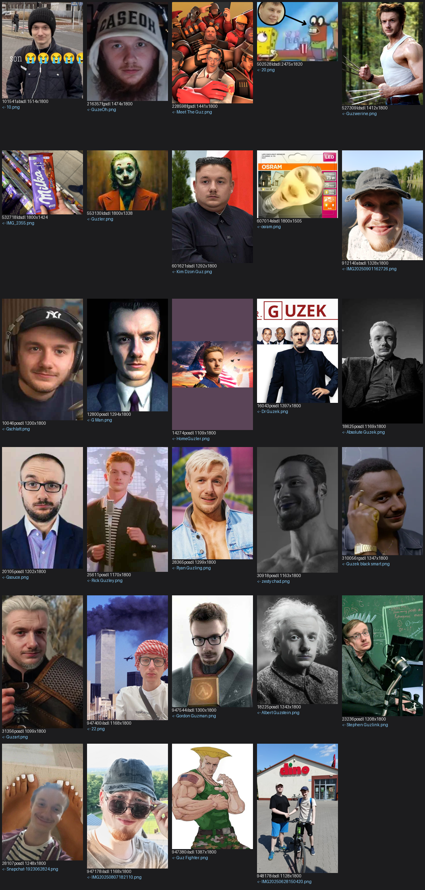
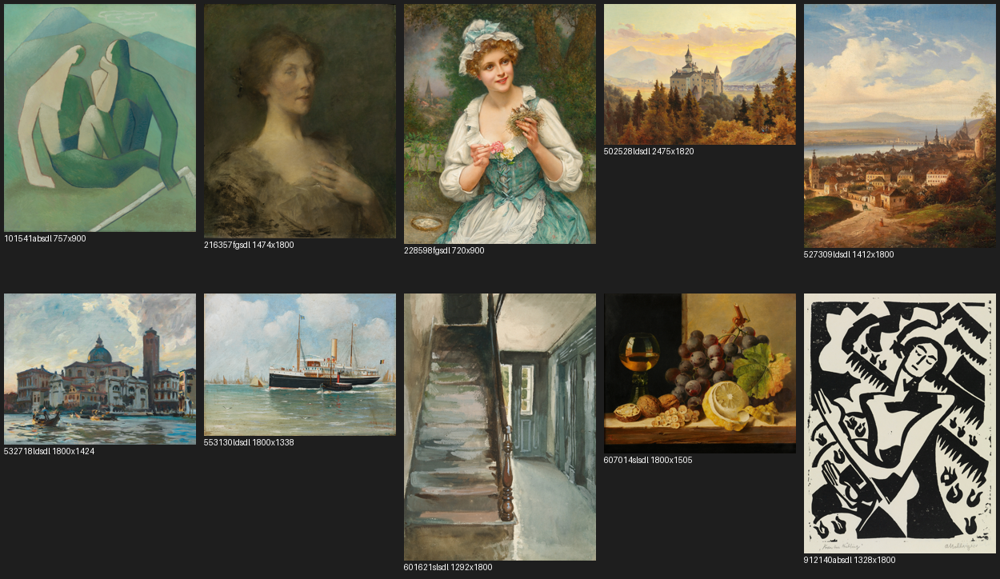
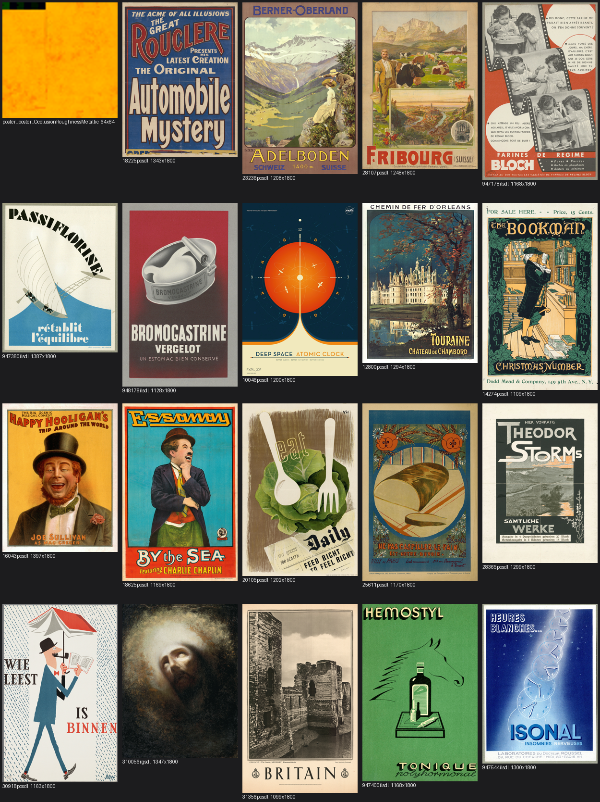

# 🎺 widzisz mnie? — mod do MECCHA CHAMELEON

Mod do gry **MECCHA CHAMELEON** (Unreal Engine 5.6, Steam), który:

- 🔊 **zmienia dźwięk gwizdu** na *„widzisz mnie?"*
- 🖼️ **podmienia obrazy i plakaty na ścianach** (29 ramek w pokojach hotelowych/„antique") na kolekcję memów **„Guzek"** + kilka zdjęć

Wszystko jako mod IoStore `_P` — nadpisuje tylko te konkretne dźwięk/tekstury, reszta gry działa normalnie. Plug-and-play, bez modyfikowania plików bazowych.

---

## 🖼️ Podgląd (co trafia na ściany)



*Każdy obrazek dopasowany proporcjami do oryginalnej ramki (cover/contain), tak żeby nic ważnego się nie ucięło.*

<details>
<summary>Oryginalne obrazy i plakaty z gry (przed)</summary>

**Obrazy:**


**Plakaty:**

</details>

---

## ⬇️ Instalacja (łatwa)

1. Pobierz najnowszy **[Release](../../releases/latest)** i rozpakuj cały ZIP do jednego folderu.
2. Uruchom **`Zainstaluj.exe`** → wybierz **Zainstaluj**.
3. Program sam znajdzie grę przez Steam i wgra mod. Po komunikacie *„ZAINSTALOWANY POMYSLNIE"* uruchom grę.

> 💡 Jeśli gra była włączona — **zamknij ją i odpal od nowa** (paki montują się przy starcie).

> ⚠️ **Windows SmartScreen:** plik `.exe` nie jest podpisany cyfrowo, więc przy pierwszym uruchomieniu Windows może pokazać „System Windows ochronił komputer" → *Więcej informacji* → *Uruchom mimo to*. To normalne dla małych, własnych narzędzi.

### Instalacja ręczna (gdyby exe był blokowany)
Skopiuj wszystkie pliki z folderu **`mod/`** (`*_P.utoc`, `*_P.ucas`, `*_P.pak`) do folderu gry:
```
...\steamapps\common\MECCHA CHAMELEON\Chameleon\Content\Paks\
```
(Folder gry najszybciej: Steam → prawy klik na grę → *Zarządzaj* → *Przeglądaj pliki lokalne* → `Chameleon\Content\Paks`.)

## 🗑️ Odinstalowanie
Uruchom `Zainstaluj.exe` → **Odinstaluj** (albo usuń pliki `*_P.*` z folderu `Paks`).

---

## 📦 Co zawiera mod
| Plik | Co zmienia |
|------|------------|
| `Chameleon-WhistleMod_P.*` | dźwięk gwizdu → „widzisz mnie?" |
| `Chameleon-CocoArt_P.*` | 29 obrazów/plakatów na ścianach |

## ✅ Wymagania
- Gra **MECCHA CHAMELEON** na Steam (ta sama wersja gry).
- Windows 10/11.

## ⚙️ Jak to zrobione (dla ciekawych)
Dźwięk i tekstury zaimportowane w **Unreal Engine 5.6**, cookowane pod Windows i spakowane do kontenera IoStore narzędziem [retoc](https://github.com/trumank/retoc) z tym samym `PackageId` co oryginały — dzięki temu pak `_P` nadpisuje dokładnie te assety.

## ⚠️ Uwagi
- Mod kosmetyczny, działa po Twojej stronie. „Sprawdź integralność plików gry" w Steam usuwa mod → wystarczy zainstalować ponownie.
- Nieoficjalny mod fanowski; nie jest powiązany z twórcami gry.
